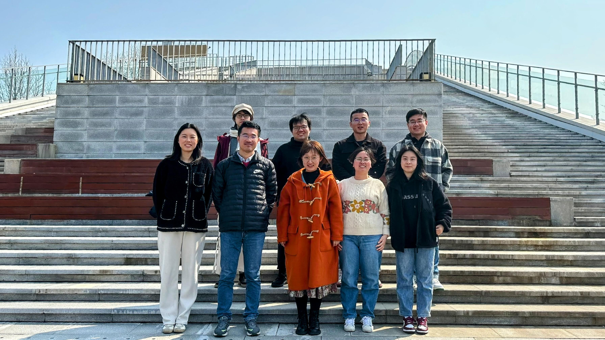

 
 

### **邢丁亮**

研究员(紫江青年学者)，博士生导师 
[华东师范大学](https://www.ecnu.edu.cn/)  [生态与环境科学学院](http://www.sees.ecnu.edu.cn/) 
[浙江天童森林生态系统国家野外科学观测研究站](http://tiantong.ecnu.edu.cn/)

地址：上海市闵行区东川路500号资环楼223 
邮编：200241 
邮箱：[xingdingliang(at)gmail(dot)com](mailto:xingdingliang@gmail.com)

 
{#id .class width=100% height=100%}

#### 教育背景

* 2009.09 -- 2014.07:  理学博士 (专业：生态学，导师：[郝占庆研究员](http://trlst.iae.ac.cn:8080/index))；
		          中国科学院沈阳应用生态研究所

* 2011.09 -- 2012.01:  访问学生；
		          [加拿大]阿尔伯塔大学可再生资源系

* 2005.09 -- 2009.07:  理学学士 (专业：数学与应用数学)；
		          北京师范大学数学科学学院

#### 工作经历

* 2019.10 -- \ \ \ \ \ \ \ \  : 研究员；华东师范大学生态与环境科学学院

* 2014.09 -- 2019.09:        博士后 (合作导师：[Prof. Fangliang He](http://www.ualberta.ca/~fhe/index.html))；
                  [加拿大]阿尔伯塔大学可再生资源系

#### 专业服务

* 为以下期刊审稿: *Biodiversity and Conservation*; *Canadian Journal of Forest Research*; *Communications Biology*; *Ecography*; *Ecological Complexity*; *Ecological Processes*; *Ecology Letters*; *Ecosphere*; *Forest Ecology and Management*; *Forest Ecosystems*; *Forests*; *Frontiers in Forests and Global Change*; *Global Ecology and Biogeography*; *Journal of Ecology*; *Journal of Environmental Management*; *Journal of Forestry Research*; *Methods in Ecology and Evolution*; *PeerJ*; *Plant Diversity*; *PLoS ONE*; *生物多样性*

#### 科研项目

* 2020--2025，华东师范大学“双百人才计划”科研启动经费，￥120万
* 2021--2024，上海市“科技创新行动计划”自然科学基金面上项目，￥20万
* 2022--2024，国家自然科学基金青年项目，￥30万

#### 研究兴趣

* 
 主要从事**群落生态学**和**数量生态学**研究，关注**不同尺度上生物多样性的格局、动态与维持机制**。

* 
研究手段主要包括**野外观测**与**理论分析**。研究工具包括`R`、`C++`、`Python`等程序语言，以及数学、统计学等相关基础方法。

* 
研究对象以**森林生态系统**为主，但并不局限于森林生态系统。

* 
**如果您有意加入我们，请先阅读我们已发表的[论文](publications.html)，并发送您的研究兴趣和简历[给我](mailto:xingdingliang@gmail.com)。**

    + 
**课题组每年招收硕士研究生1--2名，博士研究生1名。具体招生政策可参考[学校](https://yjszs.ecnu.edu.cn/)与[学院](http://www.sees.ecnu.edu.cn/index.php?classid=7323)招生网站。鼓励感兴趣的同学提前[联系我们](people.html)。**

    + 
**欢迎青年研究人员[来信商讨](mailto:xingdingliang@gmail.com)博士后与合作研究机会。**

    + 
**我们非常欢迎对生态学与生物多样科学感兴趣的本科生来课题组实习或做毕业论文/设计。**

