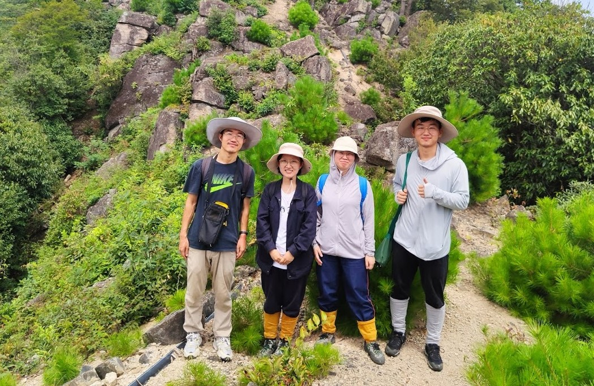

```{r setup, include=FALSE}
knitr::opts_chunk$set(echo = TRUE)
```

<div class = "row">
<div class = "col-md-5">
### **Dingliang Xing**<br>
#### **Assistant Professor**<br>
[Tiantong Forest Ecosystem National Observation and Research Station](http://tiantong.ecnu.edu.cn/)<br>
[School of Ecological and Environmental Sciences](http://www.sees.ecnu.edu.cn/)<br>
[East China Normal University](https://www.ecnu.edu.cn/)

<br>

#### Contact me: 

223 Zi-Huan Building<br>
500 Dongchuan Road<br>
Shanghai 200241<br>
China<br>
Email: [xingdingliang(at)gmail(dot)com](mailto:xingdingliang@gmail.com)
</div>

<div class = "col-md-7">

<br>
{#id .class width=100% height=100%}

</div>
</div>


<hr>

#### Education & Training

* 2009.09 -- 2014.07:  PhD in Ecology (Supervisor: [Prof. Zhanqing Hao](http://trlst.iae.ac.cn:8080/index));
		          Institute of Applied Ecology, Chinese Academy of Sciences

* 2011.09 -- 2012.01:  Visiting student ([Prof. Fangliang He](http://www.ualberta.ca/~fhe/index.html)’s Lab);
		          Department of Renewable Resources, University of Alberta

* 2005.09 -- 2009.07:  B.Sc. in Mathematics;
		          School of Mathematical Science, Beijing Normal University

<hr>

#### Appointments


* 2019.10 -- \ \ \ \ \ \ \ \ : Assistant Professor; [School of Ecological and Environmental Sciences](http://www.sees.ecnu.edu.cn/),
[East China Normal University](https://www.ecnu.edu.cn/)

* 2014.09 -- 2019.09:         Postdoctoral Fellow (Supervisor: [Prof. Fangliang He](http://www.ualberta.ca/~fhe/index.html); other collaborators: [Prof. John Spence](https://sites.ualberta.ca/~jspence/Spence_lab/), [Prof. Ellen Macdonald](https://scholar.google.com/citations?user=NVTF3XcAAAAJ&hl=en), [Prof. Scott Nielsen](http://www.ace-lab.ca/), Dr. Colin Bergeron, [Mr. David Deane](https://ecologydomine.wordpress.com/));
                  Department of Renewable Resources, University of Alberta

<hr>

#### Professional services

* Manuscript review: *Biodiversity and Conservation*; *Canadian Journal of Forest Research*; *Ecography*; *Ecological Complexity*; *Ecological Processes*; *Ecology Letters*; *Forest Ecology and Management*; *Forest Ecosystems*; *Frontiers in Forests and Global Change*; *Global Ecology and Biogeography*; *Journal of Ecology*; *Journal of Environmental Management*; *Journal of Forestry Research*; *PLoS ONE*; *生物多样性*

<hr>

#### Research interests

* Our research mainly focuses on the **diversity** and **dynamic** of ecosystems (mainly forests) at **multiple scales**, with a special emphasis on understanding various macroecological patterns, including beta diversity and many others. 

* We use both **empirical** and **theoretical** approaches to address our research questions. 

    + The empirical data we collect and analyze are mainly from forest inventories. 

    + Our current theoretical exploration relies heavily on probability theory.

    + We use `R`, `C++`, and `Python` to analyze data and implement our theoretical models. 
* <p style="color:red">**Prospective students and postdocs are encouraged to read [my papers](publications.html) and [contact me](mailto:xingdingliang@gmail.com) before applying officially.** </p>


