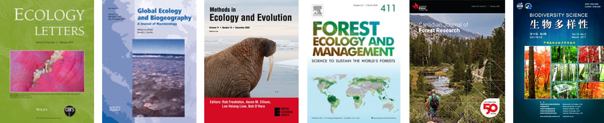

```{r setup, include=FALSE}
knitr::opts_chunk$set(echo = TRUE)
```

{#id .class width=100% height=100%}
<br>

\*Corresponding author; lab members in **bold**. See also: [Google Scholar](https://scholar.google.com/citations?user=v61F98cAAAAJ&hl=en)
<!--
#### Pre-prints:

<ol reversed>
<li>**Xing, D.\*** and F. He. 2020. Analytical models for β-diversity and the power-law scaling of β-deviation. __*bioRxiv*__ [doi: 10.1101/2020.04.19.049163](https://doi.org/10.1101/2020.04.19.049163) </li>
</ol>

-->

#### Peer-reviewed papers in English journals:

<ol reversed start=22>

<li>
Gao, Z., Y. Pan, P. M. Van Bodegom, E. Cieraad, **D. Xing**, Y. Yang, T. Xia, X. Luo, K. Song\*, L. Da, and D. Malkinson. 2023. Beta diversity of urban spontaneous plants and its drivers in nine major cities of Yunnan province, China. *Landscape and Urban Planning* 234:104741 [doi: 10.1016/j.landurbplan.2023.104741](https://doi.org/10.1016/j.landurbplan.2023.104741)
</li>

<li>
Zhang, H.-Y.\*, X.-T. Lü, C.-Z. Wei, J. R. Powell, X.-B. Wang, **D. Xing**, Z.-W. Xu, H.-L. Li, and X.-G. Han. 2023. β-diversity in temperate grasslands is driven by stronger environmental filtering of plant species with large genomes. *Ecology* 104:e3941 [doi: 10.1002/ecy.3941](https://doi.org/10.1002/ecy.3941)
</li>

<li>**Xing, D.\***, J. Zhang, and F. He. 2023. Comment on “Interspecific competition limits bird species’ ranges in tropical mountains”. *Science* 379:eade2109 [doi: 10.1126/science.ade2109](https://doi.org/10.1126/science.ade2109)
</li>

<li>He Y., K. Srisombut, **D. Xing**, N. G. Swenson, M. Asefa, M. Cao, X. Song, H. Wen, and J. Yang\*. 2022. Ontogenetic trait variation and metacommunity effects influence species relative abundances during tree community assembly. *Plant Diversity* 44:360-368 [doi: 10.1016/j.pld.2021.09.002](https://doi.org/10.1016/j.pld.2021.09.002)  </li>

<li>Deane D. C.\*, **D. Xing**, C. Hui, M. McGeoch, and F. He. 2022. A null model for quantifying the geometric effect of habitat subdivision on species diversity. *Global Ecology and Biogeography* 31:440–453 [doi: 10.1111/geb.13437](https://doi.org/10.1111/geb.13437)  </li>

<li>**Xing, D.\*** and F. He. 2021. Analytical models for β-diversity and the power-law scaling of β-deviation. *Methods in Ecology and Evolution* 12:405–414 [doi: 10.1111/2041-210X.13531](https://doi.org/10.1111/2041-210X.13531)  </li>

<li>**Xing, D.\***, J. A. C. Bergeron, K. A. Solarik, B. Tomm, S. E. Macdonald, J. R. Spence, and F. He. 2019. Challenges in estimating forest biomass: use of allometric equations for three boreal species. *Canadian Journal of Forest Research* 49:1613–1622 [doi: 10.1139/cjfr-2019-0258](https://doi.org/10.1139/cjfr-2019-0258) [**Editor's Choice**](https://www.nrcresearchpress.com/doi/story/10.4141/news.2020.03.20.100703#.XqKi1sgzZEY) </li>

<li> **Xing, D.\*** and F. He. 2019. Environmental filtering explains a U-shape latitudinal pattern in regional β-deviation for eastern North American trees. *Ecology Letters* 22:284–291 [doi: 10.1111/ele.13188](https://doi.org/10.1111/ele.13188) </li>

<li> **Xing, D.\***, S. E. Nielsen, S. E. Macdonald, J. R. Spence, and F. He. 2018. Survival and growth of residual trees in a variable retention harvest experiment in a boreal mixedwood forest. *Forest Ecology and Management* 411:187–194. [doi: 10.1016/j.foreco.2018.01.026](https://doi.org/10.1016/j.foreco.2018.01.026) </li>

<li> Lin, F., L. S. Comita, X. Wang, X. Bai, Z. Yuan, **D. Xing**, and Z. Hao\*. 2014.The contribution of understory light availability and biotic neighborhood to seedling survival in secondary versus old-growth temperate forest. *Plant Ecology* 215:795–807. [doi: 10.1007/s11258-014-0332-0](https://doi.org/10.1007/s11258-014-0332-0) </li>

<li> Erickson, D. L.\*, F. A. Jones, N. G. Swenson, N. Pei, N. A. Bourg, W. Chen, S. J. Davies, X. Ge, Z. Hao, R. W. Howe, C.-L. Huang, A. J. Larson, S. K. Y. Lum, J. A. Lutz, K. Ma, M. Meegaskumbura, X. Mi, J. D. Parker, I. Fang-Sun, S. J. Wright, A. T. Wolf, W. Ye, **D. Xing**, J. K. Zimmerman, and W. J. Kress. 2014. Comparative evolutionary diversity and phylogenetic structure across multiple forest dynamics plots: a mega-phylogeny approach. *Frontiers in Genetics* 5:358. [doi: 10.3389/fgene.2014.00358](https://doi.org/10.3389/fgene.2014.00358) </li>

<li> Bai X, T. Brenes-Arguedas, J. Ye, X. Wang, F. Lin, Z. Yuan, S. Shi, **D. Xing**, and Z. Hao\*. 2014. Dynamics of Two Multi-Stemmed Understory Shrubs in Two Temperate Forests. *PLoS ONE* 9(6): e98200 [doi: 10.1371/journal.pone.0098200](https://doi.org/10.1371/journal.pone.0098200) </li>

<li> Ye, J.\*, Z. Hao, X. Wang, X. Bai, **D. Xing**, and Z. Yuan. 2014. Local-scale drivers of multi-stemmed tree formation in Acer, in a temperate forest of Northeast China. *Chinese Science Bulletin* 59:320–325. [doi: 10.1007/s11434-013-0013-8](https://doi.org/10.1007/s11434-013-0013-8) </li>

<li> **Xing, D.**, N. G. Swenson, M. D. Weiser, and Z. Hao\*. 2014. Determinants of species abundance for eastern North American trees. *Global Ecology and Biogeography* 23:903–911. [doi: 10.1111/geb.12167](https://doi.org/10.1111/geb.12167) </li>

<li> Wang, X.\*, N. G. Swenson, T. Wiegand, A. Wolf, R. Howe, F. Lin, J. Ye, Z. Yuan, S. Shi, X. Bai, **D. Xing**, and Z. Hao. 2013. Phylogenetic and functional diversity area relationships in two temperate forests. *Ecography* 36:883–893. [doi: 10.1111/j.1600-0587.2012.00011.x](https://doi.org/10.1111/j.1600-0587.2012.00011.x) </li>

<li> Bai, X., S. A. Queenborough, X. Wang, J. Zhang, Z. Yuan, **D. Xing**, F. Lin, J. Ye, and Z. Hao\*. 2012. Effects of local biotic neighbors and habitat heterogeneity on tree and shrub seedling survival in an old-growth temperate forest. *Oecologia* 170:755–765. [doi: 10.1007/s00442-012-2348-2](https://doi.org/10.1007/s00442-012-2348-2) </li>

<li> Yuan, Z., A. Gazol, X. Wang, **D. Xing**, F. Lin, X. Bai, Y. Zhao, B. Li, and Z. Hao\*. 2012. What happens below the canopy? Direct and indirect influences of the dominant species on forest vertical layers. *Oikos* 121:1145–1153. [doi: 10.1111/j.1600-0706.2011.19757.x](https://doi.org/10.1007/s00442-012-2348-2) </li>

</ol>

#### Peer-reviewed papers in Chinese journals:

<ol reversed>
<li> Kuang, X., **D. Xing**, Z. Zhang, Y. Wang, S. Fang, Z. Yuan, J. Ye, F. Lin, X. Wang, and Z. Hao\*. 2014. Species composition and community structure of the spruce-fir forest and larch forest plots on the northern slope of Changbai Mountains, Northeast China. *Chinese Journal of Applied Ecology* 25:2149–2157. [In Chinese] </li>

<li> Song, H., J. Ye, S. Shi, Z. Zhang, X. Kuang, **D. Xing**, Z. Yuan, F. Lin, C. Cai, X. Wang\*, and Z. Hao. 2014. Woody plant species composition and community structure in residual fragments of broad-leaved Korean pine mixed forests in Changbai Mountains area. *Chinese Journal of Applied Ecology* 25:1239–1249. [In Chinese] </li>

<li> Zhang, Z., Z. Hao, J. Ye, F. Lin, Z. Yuan, **D. Xing**, S. Shi, and X. Wang\*. 2013. Short-term death dynamics of trees in natural secondary poplar-birch forest in Changbai Mountains of Northeast China. *Chinese Journal of Applied Ecology* 24:303–310. [In Chinese] </li>

<li> Wang, L., B. Li, J. Ye, X. Bai, Z. Yuan, **D. Xing**, F. Lin, S. Shi, X. Wang, and Z. Hao\*. 2011. Dynamics of short-term tree mortality in broad-leaved Korean pine (Pinus koraiensis) mixed forest in the Changbai Mountains. *Biodiversity Science* 19:260–270. [In Chinese] </li>

<li> **Xing, D.** and Z. Hao\*. 2011. The principle of maximum entropy and its applications in ecology. *Biodiversity Science* 19:295–302. [In Chinese] </li> 
</ol>

